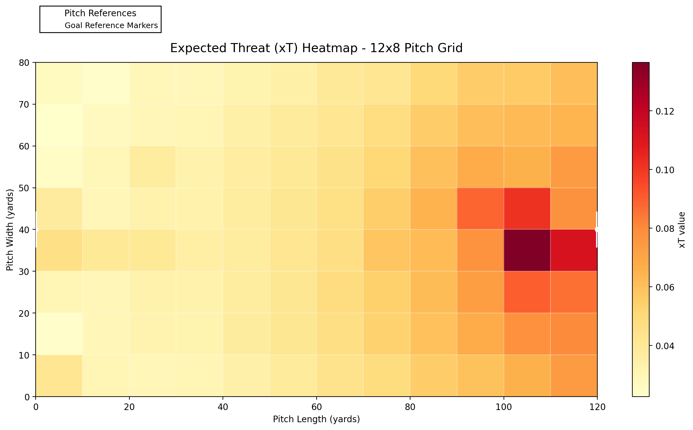

# Expected Threat (xT) Model

A complete implementation of Expected Threat (xT) for football analytics using StatsBomb data. xT quantifies the goal-scoring probability from each location on the pitch using a Markov chain approach.

## What is Expected Threat?

Expected Threat measures how much each action increases or decreases the probability of scoring a goal. It assigns a value to each zone on the pitch representing the likelihood of scoring from that position.

### Key Concepts

- **Pitch Grid**: The pitch is divided into a 12×8 grid (96 zones)
- **xT Values**: Each zone has an xT value calculated from historical data
- **Action Value**: Each pass, carry, shot, or dribble changes the threat level

### Calculation Method

xT values are calculated using iterative Markov chain convergence:

```
xT(zone) = P(goal | zone) + Σ P(transition to zone_j) × xT(zone_j)
```

This iterates until convergence (typically ~50 iterations with decay factor 0.94).

## Project Structure

```
├── models/
│   ├── pitch_grid.py              # Maps pitch coordinates to zones
│   ├── transition_matrix.py       # Builds zone-to-zone probabilities
│   ├── calculate_xt.py            # Calculates xT values via Markov iteration
│   ├── assign_xt_to_events.py     # Assigns xT to individual match events
│   └── possession_segmentation.py # Groups events into possessions
├── scripts/
│   ├── load_statsbomb_data.py     # Downloads data from StatsBomb API
│   └── ingest_normalize_events.py # Normalizes event data
├── data/
│   ├── processed/
│   │   ├── transition_matrix.npz  # Zone-to-zone probabilities
│   │   └── xt_values.npz          # xT value for each zone
│   └── raw/
└── README.md
```

## Installation

### Requirements

- Python 3.8+
- pandas
- numpy
- statsbombpy

### Setup

```bash
pip install -r requirements.txt
```

## Data Input

### Data Source

This project uses **StatsBomb open data** accessed via the `statsbombpy` library. No manual downloads required - data is fetched directly from the API.

### Available Competitions

StatsBomb provides free event-level data for:
- La Liga (2004-2021)
- Champions League
- World Cups
- NWSL
- WSL
- And more

### Input Requirements

**For building transition matrix:**
- Match IDs from StatsBomb competitions
- Events include: location coordinates, event types (Pass, Carry, Shot, etc.)
- Automatically extracted: possession chains, shot outcomes, xG values

**For calculating xT:**
- Transition matrix file (`transition_matrix.npz`) containing:
  - 96×96 zone-to-zone transition probabilities
  - 96×1 goal probability per zone
  
**For assigning xT to events:**
- xT values file (`xt_values.npz`) containing computed threat values per zone
- Match ID for analysis

### Data Format

StatsBomb events come with these key fields:
- `location`: [x, y] coordinates (120×80 yard pitch)
- `type`: Event type (Pass, Shot, Carry, Dribble, etc.)
- `pass_end_location`: End coordinates for passes
- `carry_end_location`: End coordinates for carries
- `shot_statsbomb_xg`: Expected goals value for shots
- `possession`: Possession chain identifier
- `team`, `player`: Team and player names

All coordinate transformations and zone mappings are handled automatically.

## Usage

### 1. Build Transition Matrix

Calculate zone-to-zone transition probabilities from historical matches:

```python
from models.transition_matrix import TransitionMatrixBuilder
from statsbombpy import sb

# Get matches from StatsBomb (competition_id=11 is La Liga, season_id=90 is 2020/21)
matches = sb.matches(competition_id=11, season_id=90)
builder = TransitionMatrixBuilder()

# Process multiple matches to build probability model
for match in matches.head(10).iterrows():
    builder.process_match(match[1]['match_id'])

builder.calculate_probabilities()
builder.save('data/processed/transition_matrix.npz')
```

**Input:** Match IDs from StatsBomb API  
**Output:** `transition_matrix.npz` (96×96 transition probabilities + goal probabilities)

Or run directly:
```bash
cd models
python transition_matrix.py
```

### 2. Calculate xT Values

Compute xT values for each zone using Markov iteration:

```python
from models.calculate_xt import xTCalculator

# Load transition matrix from step 1
calc = xTCalculator('data/processed/transition_matrix.npz')
calc.calculate_xt_iterative(max_iterations=100)
calc.print_summary()
calc.save('data/processed/xt_values.npz')
```

**Input:** `transition_matrix.npz` from step 1  
**Output:** `xt_values.npz` (96 threat values, one per zone)

Or run directly:
```bash
cd models
python calculate_xt.py
```

### 3. Assign xT to Match Events

```python
from models.assign_xt_to_events import xTAssigner
from statsbombpy import sb

# Load xT values from step 2
assigner = xTAssigner('data/processed/xt_values.npz')

# Get a match to analyze
matches = sb.matches(competition_id=11, season_id=90)
match_id = matches.iloc[0]['match_id']

# Assign xT to all events in the match
events_with_xt = assigner.assign_xt_to_match(match_id=match_id)

events_with_xt.to_csv('data/processed/match_with_xt.csv', index=False)
```

**Input:** `xt_values.npz` from step 2 + Match ID from StatsBomb  
**Output:** CSV with all events and their xT values

Or run directly:
```bash
cd models
python assign_xt_to_events.py
```

### 4. Generate xT Heatmap

When you run the xT calculation module, it now saves a heatmap image automatically.

```bash
python models/calculate_xt.py
```

This generates:
- `data/processed/xt_values.npz`
- `assets/xt_heatmap.png`

## Sample Output

### xT Heatmap (12x8 Grid)

Includes white goal reference markers at both ends of the pitch and a formal legend above the heatmap.



## Event-Specific xT Calculations

### Passes & Carries
```
xT_delta = xT(end_zone) - xT(start_zone)
```
Direct measure of threat added by moving the ball.

### Shots
```
xT_delta = xG - xT(start_zone)
```
Compares shot quality (xG) to positional threat.

### Dribbles
Uses possession-chain attribution with 0.94 decay factor:
- Successful dribbles that lead to shots get weighted credit
- Failed dribbles lose all threat: `xT_delta = -xT(start_zone)`
- Other dribbles use zone change: `xT_delta = xT(next_zone) - xT(start_zone)`

## Output Format

The `assign_xt_to_match()` function returns a DataFrame with these columns:

| Column | Description |
|--------|-------------|
| `event_type` | Pass, Carry, Shot, Dribble, etc. |
| `player` | Player who performed the action |
| `team` | Team name |
| `start_zone` | Zone number (0-95) where action started |
| `end_zone` | Zone number where action ended |
| `xT_start` | xT value of starting zone |
| `xT_end` | xT value of ending zone (or xG for shots) |
| `xT_delta` | Value added by the action |

## Analysis Examples

### Top Actions in a Match
```python
top_actions = events_with_xt.sort_values('xT_delta', ascending=False).head(10)
print(top_actions[['player', 'team', 'event_type', 'xT_delta']])
```

### Player Aggregations
```python
player_summary = events_with_xt.groupby('player', as_index=False)['xT_delta'].sum()
player_summary = player_summary.sort_values('xT_delta', ascending=False)
print(player_summary.head(10))
```

## Data Source

This project uses [StatsBomb](https://statsbomb.com/) open data:
- Event-level data with xG values
- La Liga, Champions League, World Cup, and more
- Accessed via `statsbombpy` Python library

## Technical Details

- **Grid Size**: 12 columns × 8 rows = 96 zones
- **Pitch Dimensions**: 120 × 80 yards (StatsBomb standard)
- **Zone Size**: 10 × 10 yards per zone
- **Convergence Tolerance**: 1e-6 (0.000001)
- **Decay Factor**: 0.94 for possession-chain attribution
- **Max Iterations**: 100 (typically converges in ~50)

## References

- Karun Singh (2018): "Introducing Expected Threat (xT)"
- StatsBomb: Open Data & Documentation
- Markov Decision Processes in football analytics

## License

Uses StatsBomb open data under their public license.
